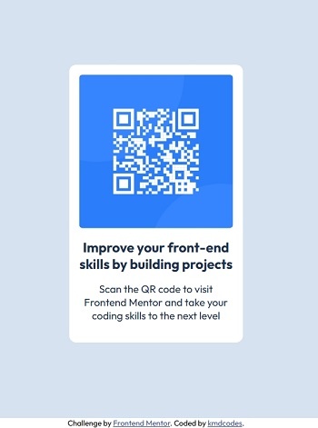

# Frontend Mentor - QR code component solution

This is a solution to the [QR code component challenge on Frontend Mentor](https://www.frontendmentor.io/challenges/qr-code-component-iux_sIO_H). Frontend Mentor challenges help you improve your coding skills by building realistic projects. 

## Table of contents

- [Overview](#overview)
  - [Screenshot](#screenshot)
  - [Links](#links)
- [My process](#my-process)
  - [Built with](#built-with)
  - [What I learned](#what-i-learned)
  - [Continued development](#continued-development)
  
- [Author](#author)


**Note: Delete this note and update the table of contents based on what sections you keep.**

## Overview

### Screenshot





### Links

- Solution URL: [Add solution URL here](https://your-solution-url.com)
- Live Site URL: [Add live site URL here](https://your-live-site-url.com)

## My process

### Built with

- HTML5 markup
- CSS custom properties
- Used CSS Flex
- Used CSS relative and absolute positioning to center the card.
- There was no need to use te @media queries to make the site responsive as the QR code card remains the same irrespective of page size and since it has been properly centred it will main the desired mobile view
- Font used: [Outfit](https://fonts.google.com/specimen/Outfit)

**Note: These are just examples. Delete this note and replace the list above with your own choices**

### What I learned

In this mini-project I learned to how to centre container one another container or element or page irrespective of the size. Below is a sample of the css styes that that drives this:
```css
.container{
    display:flex;
    flex-direction:column;
    position: relative;
    width: 100%;
    min-height: 100vh;
    justify-content: center;
    align-content: center;
    background-color: hsl(212, 45%, 89%);
}
.card{
    display:flex;
    flex-direction: column;
    
    position: absolute;
    width:250px;
    border-radius : 10px;
    left:50%;
    top : 50%;
    transform : translate(-50%, -50%);
  }


### Continued development

I intend to focus and carry out more projects that involve design beautiful user interfaces using css styles and JavaScript. I intend to work on creating components with sleek designs like modern cards, buttons, etc. I also, intend to be able to design resposive webpages with animations using CSS and JavaScript alone and no third party framework.


## Author

- Frontend Mentor - [@kmdcodes](https://www.frontendmentor.io/profile/kmdcodes)
- Twitter - [@kmdbank](https://x.com/kmdbank)
- Facebook - [@kmdbank](https://facebook.com/kmd4life)

